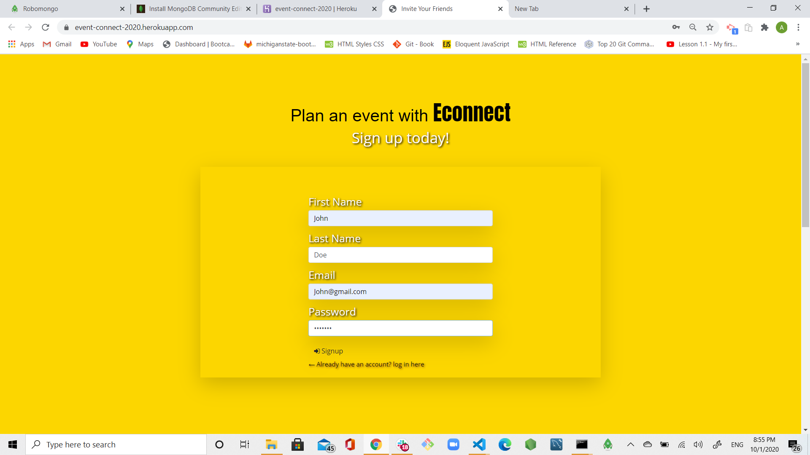
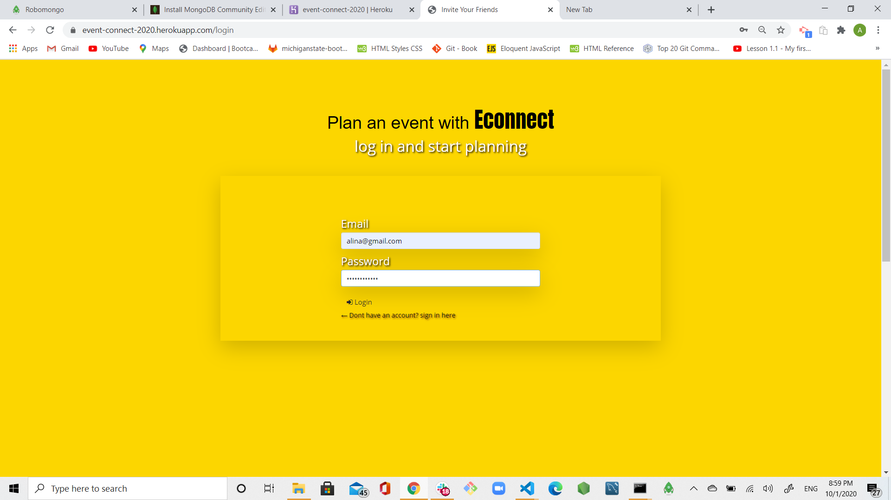
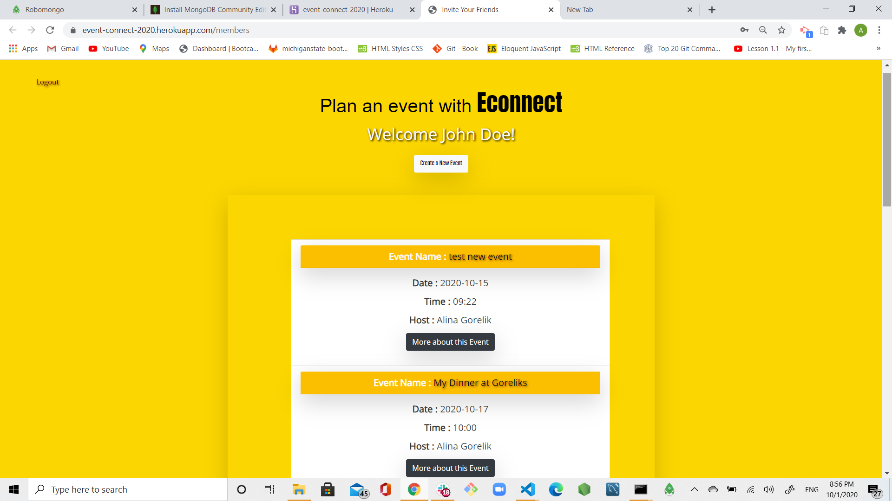
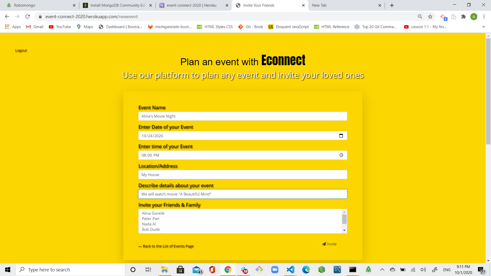
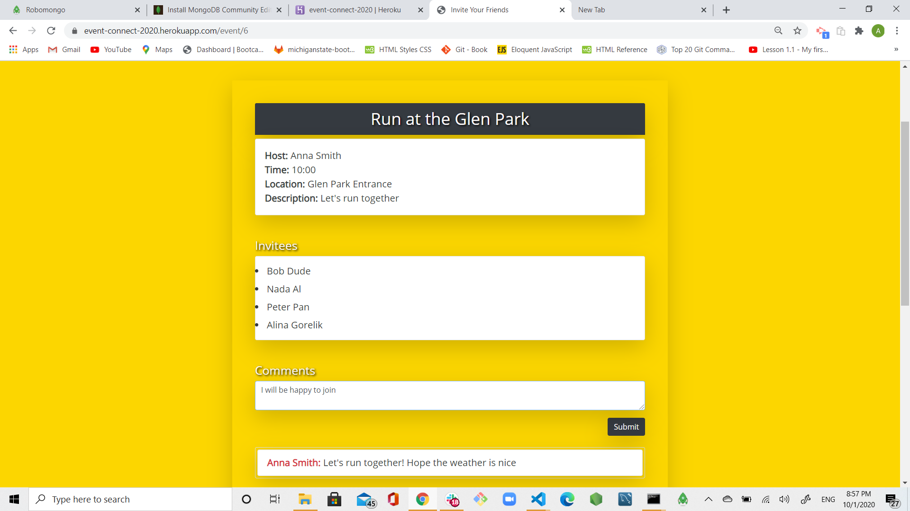

# Project 2

# EConnect

[Link to the deployed application](https://event-connect-2020.herokuapp.com/)

## Developers

Alina Gorelik: models, front and back end.
Syed Abedi: front end, schema.
Nada Abulibdeh: front end, schema.

## Table of Content

- [Description](#description)
- [Functionality](#functionality)
- [Database](#database)
- [Screen Shots](#screen-shots)
- [Development](#development)
- [Installation](#installation)
- [Dependencies](#dependencies)
- [Tests](#tests)
- [Built With](#built-with)
- [Repo](#repo)
- [Demo](#demo)

## Description

EConnect is an event logging full stack web application that utilizes Sequelize ORM, Node.js, Express, Handlebars, and Passport for secure user authentication. The application features MVC design pattern.

The main purpose of EConnect is to connect people together. In the world when people suddenly found themselves separated from their usual circle of friends, relatives and co-workers due to the COVID-19 pandemic, it is especially important to create small events that will enhance your life, spirit, and help you push through the tough experience. The application is to help people invite their friends, relatives, co-workers or neighbours to small events like bike rides, group workouts, walk through the parks or volunteering activities. It could be used to connect members of your sport club, church or neighborhood.

## Functionality

- This app requires users to sign up/create an account and log into the account subsequently. All user data is securely stored in the mysql database with the password being hashed.

- After signing-in, user is redirected to the home page that shows all the scheduled events and allows the authenticated user create a new event

- Users can view the detailed info for the event by clicking on the event name or using 'More about this event' button. He will be presented with the details as well as all the invitees and comments for the event.

- Users can create a new event by using a "Create New Event" button. After that, he will be presented with a form to complete name, date, time, location, and the description for the event. Users could invite any number of people who are also registered users for the app.

- Each user is able to leave his comments on the event page that also serves as a message board for the event. For example, an event host can enter a "Bring your own blankets" message for a "Lunch in the Park" event and invitees can use the message board to RSVP the invitation or ask the host to answer a question about the event.

## Database

The application uses MySQL database called event_db that consists of the following tables/models connected via SEQUELIZE TABLE ASSOCIATIONS.

1. USERS: id, first name, last name, email, password, created_at and updated_at timestamps (auto)
2. EVENTS: id, name of the event, event date, event time, event location, event description, full name of the host, created_at and updated_at timestamps (auto generated by SEQUELIZE)
3. INVITEES: id, invitee's first and last name, email, created_at and updated_at timestamps and EVENT_ID that is a foreign key for the connection to the EVENTS table
4. COMMENTS: id, body (comment), name of the person who left the comment, created_at, updated_at, and EVENT_ID that is a foreign key for the connection to the EVENTS table

Associations: EVENT has many INVITEES, EVENT has many COMMENTS,
INVITEE belongs to EVENT, COMMENT belongs to EVENT

## Screen Shots

Sign-up to be able to view and create events

Once a member, sign-in with user name and password

Once signed-in, user is able to view all the existing events

Once signed-in, user is able to create a new event

Once signed-in, user is able to click on any event to view details or comment

## Development

- Created the MVC structure first and worked upon each element required. Started with installing all the required dependencies, setting up the environmental variables and securing the sensitive data like password and database name by using DOTENV dependency and .ENV file. Made changes to config, models/index.js.

- Collaborated on a database structure, started just with 2 tables: Users and Events, connected the models with 'one-to-many' association. Worked on the initial phase of the application that included user's authentication utilizing passport middleware, and front-end and back-end programming changes to enable the user create an event, store it in the database, and retrieve all the events stored.

- After we were done with the programming of the initial phase, the second phase included the ability to invite people when the new event is created. With that, we had to add a new database model "Invitees" that is used to store the invitee's first and last name, email and event_id, which is a foreign key used to find all the invitees for an event. The Event model was modified to associate Event and Invitee models with one-to-many relationship: Event has multiple Invitees, Invitee belongs to the Event. Then front-end JavaScript programming was done to create ability to select invitees from the list of all the registered users, back-end code to send the selected invitees to the server and save the invitees in the Invitee table.

- The third phase of the project included changes to allow users access any previously created event and create comments.For this phase, we created a new model called "Comments", and associated the new 'Comment' model with the 'Event' model (one Event can have multiple comments, Comment belongs to the event). Front and back end coding was completed to allow users to enter comments into the text box for the Event page, save the comments entered in the Comment table, and retrieve all the comments any time the event details are displayed.

- node.js - https://nodejs.org/en/

- express NPM Package - https://www.npmjs.com/package/express

- MySQL - https://www.mysql.com/

Bootstrap, jQuery

## Installation

To use this application locally:

- Install Node.js on your computer.
- Use `npm init` to build package.json and node_modules.
- Use `npm install` to install all the dependencies, see [Dependencies](#dependencies) for the complete list
- Utilizing MySQL or MSSQL workbench, create the DB using the schema.sql file
- Use the _seed.sql_ file to popluate the DB
- Once you have all the above created, you can edit the _server.js_ file where the password is and add your password to access your local DataBase.
- Open a terminal, navigate to the folder where **_server.js_** is located and type: `node server.js`
- Once the server is running, open a browser and navigate to localhost:8080 or the port you have selected

## Dependencies

    "bcryptjs": "2.4.3",
    "dotenv": "^8.2.0",
    "express": "^4.17.0",
    "express-handlebars": "^5.1.0",
    "express-session": "^1.16.1",
    "mysql2": "^1.6.5",
    "passport": "^0.4.0",
    "passport-local": "^1.0.0",
    "sequelize": "^5.8.6"
    "@handlebars/allow-prototype-access": "^1.0.3"

- Sequelize - https://www.npmjs.com/package/sequelize

- Passport - https://www.npmjs.com/package/passport

- Express Handlebars - https://www.npmjs.com/package/express-handlebars

- Dotenv - https://www.npmjs.com/package/dotenv

## Built With

- [VScode](https://code.visualstudio.com/)
- [Gitbash](https://gitforwindows.org/)
- [node.js](https://nodejs.org/en/)
- [express.js](https://expressjs.com/)
- [MySql](https://www.mysql.com/)

## Repo:

https://github.com/sabedi571/Project_2
